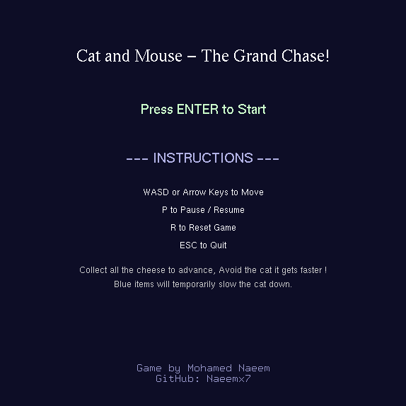

# Cat and Mouse - The Grand Chase!

*A Classic Maze-Chase Game built with C++ and OpenGL*



## About The Project

This project is a 2D maze game developed as a final project for a 3rd-year Computer Graphics course. It's a modern take on classic arcade maze games, built from scratch using C++ and the OpenGL Utility Toolkit (GLUT). The game demonstrates core concepts of 2D graphics rendering, game loop management, state machines, and basic pathfinding AI.

The player controls the Mouse, whose goal is to collect all the cheese in the maze. However, an intelligent Cat is constantly hunting the player using a Breadth-First Search (BFS) algorithm to find the shortest path. Can you clear all three levels before you're caught?

### Key Features

*   **Classic Arcade Gameplay:** Simple to learn, but challenging to master.
*   **Intelligent Enemy AI:** The cat doesn't just wander randomly; it actively hunts you using a BFS pathfinding algorithm.
*   **Dynamic Difficulty:** The cat gets faster as you collect more cheese, increasing the tension.
*   **Power-Ups:** Grab the blue sparkle to temporarily slow the cat down and make your escape!
*   **Multiple Levels:** Three unique, hand-designed mazes to conquer.
*   **Polished User Experience:** Features an animated intro, clear menus, and full support for window resizing.

---

## Download & Play

Playable versions for both Linux and Windows are available.

1.  Go to the **[Releases Page](https://github.com/Naeemx7/ChasingGameCPP/releases)** of this repository.
2.  Download the appropriate file for your operating system (`.tar.gz` for Linux, `.zip` for Windows).

#### Running on Linux (Debian/Ubuntu/MX Linux)
1.  Extract the archive: `tar -xzvf CatAndMouse-Linux.tar.gz`
2.  Navigate into the new folder: `cd CatAndMouse-Linux`
3.  Run the launch script: `./run.sh`

The script will automatically check if you have the `freeglut3` library. If not, it will give you the command to install it.

#### Running on Windows
1.  Extract the `.zip` folder.
2.  Double-click the `ChasingGame.exe` file to play. The required `freeglut.dll` is included.

---

## Building from Source

If you wish to compile the game yourself, you will need a C++ compiler and the `freeglut` development libraries.

#### Dependencies

*   **On Debian-based Linux (Ubuntu, MX Linux):**
    ```bash
    sudo apt-get update && sudo apt-get install build-essential freeglut3-dev
    ```
*   **On Windows:** A MinGW-w64 toolchain is recommended. You will need to get the `freeglut` development libraries and configure your IDE's linker settings to find the `include` and `lib` directories.

#### Compile Command (Linux Example)
Once dependencies are installed, you can compile from the project's root directory with:
```bash
g++ main.cpp -o ChasingGame -lGL -lGLU -lglut
